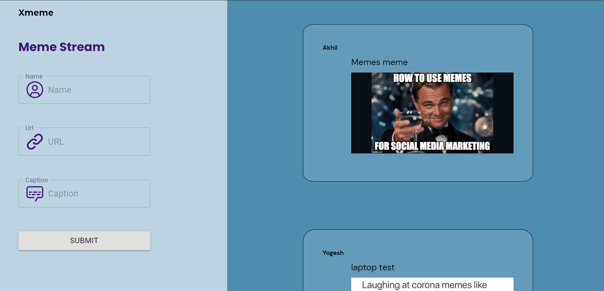

***Table of Contents***
- [Xmeme app](#xmeme-app)
- [Project Status](#project-status)
    - [Publicly deployed URLs](#publicly-deployed-urls)
- [Backend](#backend)
- [Project Screen Shot](#project-screen-shot)
- [Built With](#built-with)
- [Installation and Setup Instructions](#installation-and-setup-instructions)
- [Reflection](#reflection)
- [Contact](#contact)

# Xmeme app

1. Users can post Memes by providing these inputs
   - Name of the person posting the meme
   - Caption for the Meme
   - URL of the Meme image
2. Users can view the latest 100 memes posted
   - If they post a new meme, that will also get listed. These submitted memes will be shown one below the other.
   - Each meme will display the name of the meme maker, the caption for the meme and the image pulled from the meme URL.

# Project Status

Basic functionality is up and running

### Publicly deployed URLs

- [Frontend](https://xmeme.vercel.app/) : https://xmeme.vercel.app
- [Backend](https://xmeme174.herokuapp.com/memes) : https://xmeme174.herokuapp.com

# Backend

1. The backend is capable of receiving the posted meme inputs from the frontend and store them in a database.  
   
2. The backend is capable of fetching the list of memes from the database and send them to the frontend.  

3. Endpoint to send a meme to the backend
   - Endpoint - /memes
   - HTTP Method - POST
   - Json Body should contain the inputs - name, url, caption
   - The backend allocates a unique id for the meme and returns it as a json response  

4. Endpoint to fetch the latest 100 memes from the backend
   - Endpoint - /memes
   - HTTP Method - GET
   - Error: If there are no memes available, an empty array is returned  

5. Endpoint to fetch a single Meme based on id
    - Endpoint - /memes/\<id\>
    - HTTP Method - GET
    - Error: If a meme with that id doesn’t exist, a 404 HTTP response code is returned  

# Project Screen Shot

# Built With

**React** - The frontend framework used  
**Flask** - The backend mini-framework used  
**MySQL** - The database used  

# Installation and Setup Instructions

Clone down this repository. You will need `node` and `npm` installed globally on your machine.

Installation:

`npm install`

To Start Server:

`npm run`

To Visit App:

`localhost:3000`

# Reflection

This was a 1 week long project built during my second module at Crio WOD program. Project goals included using technologies learned up until this point and familiarizing myself with deployment and documentation. This project truly gave me a good experience and understanding of the lifecycle of a fullstack application i.e. from frontend, backend and databases to deployment.

# Contact

Surapaneni Yogesh - surapaneniyogesh11@gmail.com  
Connect with me on [LinkedIN](https://www.linkedin.com/in/surapaneni-yogesh-ba7303189/)